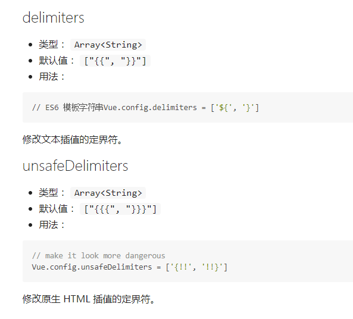

# 第一章 Vue.js特性

1. 确实轻量

    除了以MVP模式代表的Riot.js外，Vue.js已经算是前端库里面体积非常小的，但不依赖其他基础库。

2. 数据绑定

    对于一些富交互、状态机类似的前端UI界面，数据绑定非常方便、简单。

3. 指令

    类似于AngularJS，可以使用一些内置的简单指令(v-*)，也可以自定义指令，通过对应表达式值得变化就可以修改对应的DOM。

4. 插件化

    Vue.js核心库不包含Router、AJAX、表单验证等功能，但是可以非常方便地加载对应的插件。

# Vue.js与其他框架的区别

## 与AngularJS的区别

相同点：

- 都支持指令--内置指令和自定义指令。
- 都支持过滤器--内置过滤器和自定义过滤器。
- 都支持双向绑定。
- 都不支持低端浏览器(比如IE6/7/8)
    + Vue.js使用比如Array.isArray的ES5特性。
    + AngularJS 1.3开始不支持IE8。

不同点：

- AungularJS的学习成本比较高，而Vue.js本身提供的API都比较简单、直观。
- 在性能上，AngularJS依赖对数据做脏检查，所以Watcher越多越慢。Vue.js使用基于依赖追踪的观察并且使用异步队列更新，所有的数据都是独立触发的。

## 与React的区别

相同点：

- React采用特殊的JSX语法，Vue.js在组件开发中也推崇编写.vue特殊文件格式，对文件内容都有一些约定，两者都需要编译后使用。
- 中心思想相同：一切都是组件，组件实例之间可以嵌套。
- 都提供合理的钩子函数，可以让开发者定制化地处理需求。
- 都不内置类似AJAX、Router等功能到核心包，而是以其他方式(插件)加载。
- 在组件开发中都支持mixns的特性。

不同点：

- React依赖Virtual DOM，而Vue.js使用的是DOM模版。React采用的Virtual DOM会对渲染出来的结果做脏检查。
- Vue.js在模版中提供了指令、过滤器等，可以非常方便、快捷地操作DOM。

## 安装

- script

    直接通过script加载CDN文件，代码示例如下：

    `<script src="http://apps.bdimg.com/libs/vue/1.0.14/vue.js"></script>`

- npm

    如果项目基于npm管理依赖，则可以使用npm来安装Vue，执行如下命令：

    `$ npm i vue --save-dev`

- bower

    如果项目基于bower管理依赖，则可以使用bower来安装Vue，执行如下命令：

    `$ bower i vue --save-dev`

## 第一个HELLO World程序

代码示例如下：

```html
<div id="didi-navigator">
  <ul>
    <li v-for="tab in tabs">
      {{ tab.text }}
    </li>
  </ul>
</div>

new Vue({
  el: "#didi-navigator",
  data: {
    tabs: [
      { text: '巴士' },
      { text: '快车' },
      { text: '专车' },
      { text: '顺风车' },
      { text: '出租车' },
      { text: '代驾' }
    ]
  }
})
```

# 第二章 数据绑定

参考资料：

[Vue.js之数据绑定](http://www.cnblogs.com/fly_dragon/p/6218675.html "Vue.js之数据绑定")

## 插值

文本插值是最基本的形式，使用双大括号{{}}，代码示例如下：

`<span>Text: {{ text }}</span>`

只需要渲染一次数据，后续数据变化不再关心，可以通过"*"实现，代码示例如下：

`<span>Text: {{ *text }}</span>`

双大括号标签会把里面的值全部当做字符串来处理，如果是HTML片段，则可以使用三个大括号来绑定，代码示例如下：

```html
<div>Logo: {{{ logo }}}</div>
logo: '<span>DDFE</span>'
```

双大括号还可以放在HTML标签内，示例如下：

`<li data-id='{{ id }}'></li>`

## 表达式

Mustache标签也接受表达式形式的值，表达式可由JavaScript表达式和过滤器构成。过滤器可以没有，也可以有多个。

表达式是各种数值、变量、运算符的综合体。简单的表达式可以是常量或者变量名称。表达式的值是其运算结果，代码示例如下：

```html
<!-- JS表达式 -->
{{ cents/100 }}     //在原值的基础上除以100
{{ true ? 1 : 0 }}  //值为真，则渲染出1，否则渲染出0
{{ example.split(",") }}

<!-- 无效示例 -->
{{ var logo = 'DDFE' }}       //这是语句，不是表达式
{{ if(true) return 'DDFE' }}  //条件控制语句是不支持的，可以使用三元式
```

类似于Linux中的管道，Vue.js允许在表达式后面添加过滤符，代码示例如下：

`{{ example | toUpperCase }}`

## 指令



# 第三章 指令

## 内部指令

### v-if

v-if指令可以完全根据表达式的值在DOM中生成或移除一个元素。如果v-if表达式赋值为false，那么对应的元素就会从DOM中删除；否则，对应元素的一个克隆将被重新插入DOM中。代码示例如下：

```html
<div id="example">
  <span>nothing</span>
  <p v-if="greeting">Hello</p>
</div>
<script>
  var app = new Vue({
    el: "#example",
    data: {
      greeting: true
    }
  })
</script>
```

因为v-if是一个指令，需要将它添加到一个元素上。但是如果想切换多个元素，则可以把&lt;template&gt;元素当做包装元素，并在其上使用v-if，最终的渲染结果不会包含它。代码示例如下：

```html
<template v-if="ok">
  <h1>Title</h1>
  <p>Paragraph 1</p>
  <p>Paragraph 2</p>
</template>
```

### v-show

v-show指令是根据表达式的值来显示或者隐藏HTML元素。当v-show赋值为false时，元素将被隐藏。查看DOM时，会发现元素上多了一个内联样式`style="display: none;"`。代码示例如下：

```html
<input type="text" v-model="message" placeholder="edit me">
<div id="example">
  <p v-show="greeting">Hello!</p>
</div>
<script>
  var vm = new Vue({
    el: "#example",
    data: {
      greeting: false
    }
  })
</script>
```

**注：v-show不支持\<template\>语法，也不支持`v-else`**

在切换v-if模块时，Vue.js有一个局部编译/卸载的过程，因为v-if中的模版可能包括数据绑定或子组件。v-if是真实的条件渲染，因为它会确保条件块在切换时合适地销毁与重建条件块内的事件监听器和子组件。

v-if是惰性的---如果初始渲染时条件为假，则什么也不做，在条件第一次变为真时才开始局部编译(编译会被缓存起来)。

相比之下，v-show简单得多---元素始终被编译并保留，只是简单的基于CSS切换。

一般来说，v-if有更高的切换消耗，而v-show有更高的初始渲染消耗。因此，如果需要频繁地切换，则使用v-show较好；如果在运行条件不大可能改变，则使用v-if较好。

### v-else

就是JavaScript中else的意思，它必须跟着v-if或v-show，充当else功能。代码示例如下：

```html
<body>
  <div id="example">
    <p v-if="ok">我是对的</p>
    <p v-else="ok">我是错的</p>
  </div>
</body>
<script>
  var exampleVM2 = new Vue({
    el: '#example',
    data: {
      ok: false
    }
  })
</script>
```

将v-show用在组件上时，因为指令的优先级v-else会出现问题，所以不要这样做。代码示例如下：

```html
<custom-component v-show="condition"></custom-component>
<p v-else>这可能也是一个组件</p>
```

我们可以用另一个v-show替换v-else，代码示例如下：

```html
<custom-component v-show="condition"></custom-component>
<p v-show="!condition">这可能也是一个组件</p>
```

### v-model

v-model指令用来在input、select、text、checkbox、radio等表单控件元素上创建双向数据绑定。根据控件类型v-model自动选取正确的方法更新元素。但是v-model不过是语法糖，在用户输入时间中更新元素，以及特别处理一些极端的例子。代码示例如下：

```html
<div id="example">
  <form>
  姓名：
    <input type="text" v-model="data.name" placeholder="">
    <br>
    性别：
    <input type="radio" id="man" value="One" v-model="data.sex">
    <label for="man">男</label>
    <input type="radio" id="male" value="Two" v-model="data.sex">
    <label for="male">女</label>
    <br>
    兴趣：
    <input type="checkbox" id="book" value="book" v-model="data.interest">
    <label for="book">阅读</label>
    <input type="checkbox" id="swim" value="swim" v-model="data.interest">
    <label for="swim">游泳</label>
    <input type="checkbox" id="game" value="game" v-model="data.interest">
    <label for="game">游戏</label>
    <input type="checkbox" id="song" value="song" v-model="data.interest">
    <label for="song">唱歌</label>
    <br>
    身份：
    <select v-model="data.identity">
      <option value="teacher" selected="selected">教师</option>
      <option value="doctor">医生</option>
      <option value="lawyer">律师</option>
    </select>
  </form>
  {{data.name}}
  <br>
  {{data.sex}}
  <br>
  {{data.interest}}
  <br>
  {{data.identity}}
  <br>
</div>
<script>
var vm = new Vue({
  el: "#example",
  data: {
    data: {
      name: '',
      sex: '',
      interest: [],
      identity: ''
    }
  }
})
</script>
```

除了以上用法，在v-model指令后面还可以添加多个参数(number、lazy、debounce)。

1. number

   如果想将用户的输入自动转换为Number类型(如果原值的转换结果为NaN，则返回原值)，则可以添加一个number特性。

2. lazy

    在默认情况下，v-model在input事件中同步输入框的值与数据，我们可以添加一个lazy特性，从而将数据改到change事件中发生。代码示例如下：

    ```html
    <body id="example">
      <input v-model="msg" lazy>
      <br>
      {{ msg }}
      <script>
        var exampleVM2 = new Vue({
          el: '#example',
          data: {
            msg: '内容是在change事件后才改变的~'
          }
        })
      </script>
    </body>
    ```

3. debounce

    设置一个最小的延时，在每次敲击之后延时同步输入框的值与数据。如果每次更新都要进行高耗操作(例如，在input中输入内容时要随时发送AJAX请求)，那么它较为有用。代码示例如下：

    ```html
    <body id="example">
      <input type="text" v-model="msg" debounce="5000">
      <br>
      {{ msg }}
      <script>
        var vm = new Vue({
          el: "#example",
          data: {
            msg: '内容是在5000ms后才改变的~'
          }
        })
      </script>
    </body>
    ```

### v-for

我们可以使用v-for指令基于源数据重复渲染元素。我们也可以使用$index来呈现相对应的数据索引，代码示例如下：

```html
<body id="example">
  <ul id="demo">
    <li v-for="item in items" class="item-{{$index}}">
    {{ $index }} - {{ parentMssage }}  {{ item.msg }}
    </li>
  </ul>
  <script>
    var vm = new Vue({
    el: "#example",
      data: {
        parentMssage:'滴滴',
      items: [
        { msg: '滴滴顺风车' },
        { msg: '滴滴专车' }
      ]
    }
  })
  </script>
</body>
```

v-for需要特殊的别名，形式为`item in items`(items是数据数组，item是当前数组元素的别名)。Vue.js 1.0.17及以后版本支持of分隔符，用法如下：

`<div v-for="item of items"></div>`

使用v-for，将得到一个特殊的作用域，类似于AngularJS的隔离作用域，我们需要明确指定prop属性传递数据，否则在组件内将获取不到数据。对于组件内的&lt;p&gt;标签，我们可以使用&lt;slot&gt;

```html
<my-item v-for="item in items" :item="item" :index="$index">
  <p>{{item.text}}</p>
<my-item>
```

Vue.js包装了被观察数组的变异方法，它们能触发视图更新。被包装的方法有：

- push()
- pop()
- shift()
- unshift()
- splice()
- sort()
- reverse()

Vue.js还增加了两个方法来观测变化：$set、$remove。

我们应该尽量避免直接设置数据绑定的数组元素，因为这些变化不会被Vue.js检测到，因而也不会更新视图渲染。这时，我们可以使用$set方法：

```javascript
// same as `demo.items[0] = ...` but triggers view update
demo.item.$set(0, { childMsg: 'Changed!' })
```

$remove是splice的语法糖，用于从目标数组中查找并删除元素。因此，不必这样：

```javascript
var index = this.items.indexOf(item)
if(index !== -1) {
  this.item.splice(index, 1)
}
```

只用这样：

```javascript
demo.item.$remove(item)
```

另外，也可以使用filter、concat、slice方法，返回的数组将是一个不同的实例。我们可以用新的数组替换原来的数组。

```javascript
demo.items = demo.items.filter(function(item) {
  return items.childMsg.match(/Hello/)
})
```

在某些情况下，我们有时可能需要用全新对象(例如，通过API调用创建的对象)来替换数组。因为在默认情况下，v-for通过数据对象的特征来决定对已有作用域和DOM元素的复用程度，这可能导致重新渲染整个列表。但是，如果每个对象都有一个唯一的ID属性，便可以使用track-by特性给Vue.js一个提示，因而Vue.js能尽可能地复用已有实例。假定数据为：

```json
{
  items: {
    {_uid: '88f869d', ...},
    {_uid: '7496c10', ...}
  }
}
```

可以这样给出提示，代码示例如下：

```html
<div v-for="item in items" track-by="_uid">
<!-- content -->
</div>
```

在替换数组items时，如果Vue.js遇到一个包含有`_uid: '88f869d'`的新对象，那么它知道可以复用这个已有对象的作用域与DOM元素。

如果没有唯一的键跟踪，则可以使用`track-by="$index"`，它强制让v-for进入原位更新模式：片段不会被移动，而是简单的以对应索引的新值刷新。这种模式也能处理数据数组中重复的值。

这让数据替换非常高效，但是也会付出一定的代价。因为这时DOM节点不再映射数组元素顺序的改变，不能同步临时状态(比如&lt;input&gt;元素的值)，以及组件的私有状态。因此，如果v-for块包含&lt;input&gt;元素或子组件，则要小心使用`track-by="$index"`。

因为JavaScript的限制，Vue.js不能检测到下面数组的变化：

- 直接用索引设置元素，如`vm.items[0] = {}`。
- 修改数据的长度，如`vm.items.length = 0`。

为了解决前一个问题，Vue.js扩展了观察数组，我们可以使用上面讲过的$set方法：

```javascript
// 与`example1.items[0] = ...`相同，但是能触发视图更新
vm.items.$set(0, { childMsg: 'Changed!' })
```

至于后一个问题，只需用一个空数组替换items即可。

有时我们可能想重复一个包含多个DOM元素的块，在这种情况下，则可以使用&lt;template&gt;标签来包装重复片段。这里的&lt;template&gt;标签只充当一个语义包装器。代码示例如下：

```html
<ul>
  <template>
    <li>{{list.msg}}</li>
    <li class="divider"></li>
  </template>
</ul>
```

我们也可以使用v-for遍历一个对象，每一个重复的实例都将有一个特殊的属性$key，或者给对象的键值提供一个别名。代码示例如下：

```html
<body id="example">
  <ul id="repeat-object">
    <li v-for="value in primitiveValues">{{$key}} : {{value}</li>
    <li>===</li>
    <li v-for="(key, item) in objectValues">{{key}} : {{item.msg}}</li>
  </ul>
  <script>
    var vm = new Vue({
      el: "#repeat-object",
      data: {
        primitiveValues: {
          FirstName: 'DIDI',
          LastName: 'FE',
          Age: 4
        },
        objectValues: {
          one: {
            msg: 'Hello'
          },
          two: {
            msg: 'DIDI FE'
          }
        }
      }
    })
	</script>
</body>
```

**注：ECMAScript5无法检测到新属性添加到一个对象上或者在对象中删除。要处理这种情况，Vue.js增加了三种方法：`$add(key, value)`、`$set(key, value)`和`$delete(key)`，这些方法可以用来添加和删除属性，同时触发视图更新。**

v-for也支持整数。代码示例如下：

```html
<div id="range">
  <div v-for="n in 10">Hi! {{$index}}</div>
</div>
```

将模版重复整数次。

v-for同时还可以和Vue.js提供的内置过滤器或排序数据一起使用。

1. filterBy

    语法： `filterBy searchKey[in dataKey...]`

    用法：

    ```html
    <input type="text" v-model="searchText">
    <ul>
      <li v-for="user in users | filterBy searchText in 'name'">{{user.name}}</li>
    </ul>
    ```

    数据如下：

    ```json
    users: [
      {
        name: '快车',
        tag: '1'
      },
      {
        name: '出租车',
        tag: '2'
      },
      {
        name: '顺风车',
        tag: '3'
      },
      {
        name: '专车',
        tag: '4'
      },
    ]
    ```

    在&lt;ul&gt;标签中展示滴滴业务类型，在输入框中输入“快车”，&lt;ul&gt;中数据或根据所输入的“快车”，在user的name字段中过滤出我们需要的信息，并展示出来。

2. orderBy

    语法：`orderBy sortKey[reverseKey]`

    用法：

    ```html
    <body id="example">
      <ul>
        <li v-for="user in users | orderBy field reverse">{{user.name}}</li>
      </ul>
      <script>
        var vm = new Vue({
          el: "#example",
          data: {
            field: 'tag',
            reverse: false,
            users: [
              {
                name: '快车',
                tag: 1
              },
              {
                name: '出租车',
                tag: 3
              },
              {
                name: '顺风车',
                tag: 2
              },
              {
                name: '专车',
                tag: 0
              }
            ]
          }
        })
      </script>
    </body>
    ```

    在&lt;ul&gt;标签中根据field变量代表的tag字段正序排列数据。

### v-text

v-text指令可以更新元素的textContent。在内部，{{ Mustache }}插值也被编译为textNode的一个v-text指令。代码示例如下：

```html
<span v-text="msg"></span>
<!-- same as -->
<span>{{ msg }}</span>
```

### v-html

v-html指令可以更新元素的innerHTML。内容按普通HTML插入——数据绑定被忽略。如果想复用模版片段，则应当使用partials。

在内部，{{{ Mustache }}}插值也会被编译为锚节点上的一个v-html指令。

**注： 不建议在网站上直接动态渲染任意HTML片段，很容易导致XSS攻击。**

```html
<div v-html="html"></html>
<!-- same as -->
<div>{{{ html }}}</div>
```

### v-bind

v-bind指令用于相应更新HTML特性，将一个或多个attribute，或者一个组件prop动态绑定到表达式。v-bind可以简写为：

```html
<!-- 绑定 attribute -->

<!-- 缩写 -->

```

在绑定class或style时，支持其他类型的值，如数组或对象。代码示例如下：

```html
<body id="example">
  <div :class="[classA, { classB: isB, classC: isC }]"></div>
  <script>
    var vm = new Vue({
      el: "#example",
      data: {
        classA: 'A',
        isB: false,
        isC: true
      }
    })
  </script>
</body>
```

没有参数时，可以绑定到一个对象。注意，此时class和style绑定不支持数组和对象(对象key会转换为小写)。代码示例如下：

```html
<body id="example">
  <div v-bind="{ id: someProp, 'OTHERAttr': otherProp }"></div>
  <script>
    var exampleVM2 = new Vue({
      el: '#example',
      data: {
        someProp: 'idName',
        otherProp: 'prop'
      }
    })
  </script>
</body>
```

在绑定prop时，prop必须在子组件中声明。可以用修饰符指定不同的绑定类型。修饰符为：

- .sync  ——双向绑定，只能用于prop绑定。
- .once  ——单次绑定，只能用于prop绑定。
- .camel  ——将绑定的特性名字转换回驼峰命名。只能用于普通HTML特性的绑定，通常用于绑定用驼峰命名的SVG特性，比如viewBox。

```html
<!-- prop 绑定， "prop" 必须在 my-component 组件内声明 -->
<my-component :prop="someThing"></my-component>
<!-- 双向 prop 绑定-->
<my-component :prop.sync="someThing"></my-component>
<!-- 单次 prop 绑定 -->
<my-component :prop.once="someThing"></my-component>
```

### v-on

v-on指令用于绑定时间监听器。事件类型由参数指定；表达式可以是一个方法的名字或一个内联语句；如果没有修饰符，也可以省略。

使用在普通元素上时，只能监听原生DOM事件；使用在自定义元素组件上时，也可以监听子组件触发的自定义事件。

在监听原生DOM事件时，如果只定义一个参数，DOM event为事件的唯一参数；如果在内联语句处理器中访问原生DOM事件，则可以使用特殊变量$event把它传入方法。

Vue.js 1.0.11 及以后版本在监听自定义事件时，内联语句可以访问一个$arguments属性，它是一个数组，包含了传给子组件的$emit回调的参数。

```html
<!-- 方法处理器 -->
<button v-on:click="doThis"></button>
<!-- 内联语句 -->
<button v-on:click="doThat('hello', $event)"></button>
<!-- 缩写 -->
<button @click="doThis"></button>
```

v-on后面不仅可以跟参数，还可以增加修饰符

- .stop - 调用 `event.stopPropagation()`。
- .prevent - 调用 `event.preventDefault()`。
- .capture - 添加事件侦听器时使用`capture`模式。
- .self - 只当事件是从侦听器绑定的元素本身触发时才触发回调。
- .{keyCode | keyAlias} - 只在指定按键上触发回调。Vue.js提供的键值有：`[esc:27, tab:9, enter:13, space:32, 'delete':[8, 46], up:38, left:37, down:10, right:39]`

```html
<!-- 停止冒泡 -->
<button @click.stop="doThis"></button>
<!-- 阻止默认行为 -->
<button @click.prevent="doThis"></button>
<!-- 阻止默认行为，没有表达式 -->
<form @submit.prevent></form>
<!-- 串联修饰符 -->
<button @click.stop.prevent="doThis"></button>
<!-- 键修饰符，键别名 -->
<input @keyup.enter="onEnter">
<!-- 键修饰符，键代码 -->
<input @keyup.13="onEnter">
```

### v-ref

在父组件上注册一个子组件的索引，便于直接访问。不需要表达式，必须提供参数id。可以通过父组件的`$refs`对象访问子组件。

当`v-ref`和`v-for`一起使用时，注册的值将是一个数组，包含所有的子组件，对应于绑定数组；如果`v-for`使用在一个对象上，注册的值将是一个对象，包含所有的子组件，对应于绑定对象。

**注：** 因为HTML不区分大小写，camelCase风格的名字比如`v-ref:someRef`将全部转换为小写。可以用`v-ref:some-ref`设置`this.$refs.someRef`。 

### v-el

为DOM元素注册一个索引，方便通过所属实例的`$els`访问这个元素。可以用`v-el:some-el`设置`this.$els.someEl`。

```html
<span v-el:msg>hello</span>
<span v-el:other-msg>world</span>
```

通过`this.$els`获取相应的DOM元素

```javascript
this.$els.msg.textContent // -> "hello"
this.$els.otherMsg.textContent // -> "world"
```

### v-pre

编译时跳过当前元素和它的子元素。可以用来显示原始Mustache标签。跳过大量没有指令的节点会加快编译。

### v-cloak

v-cloak这个指令保持在元素上直到关联实例结束编译。当和CSS规则如`[v-cloak]{ display: none }`一起使用时，这个指令可以隐藏未编译的Mustache标签直到实例准备完毕。用法如下：

```html
[v-cloak] {
  display: none;
}
<div v-cloak>
  {{ message }}
</div>
```

## 自定义指令

### 基础

除了内置指令，Vue.js也允许注册自定义指令。自定义命令提供一种机制将数据的变化映射为DOM行为。

Vue.js用`Vue.directive(id, definition)`方法注册一个全局自定义指令，它接收两个参数：指令ID与定义对象。也可以用组件的directive选项注册一个局部自定义指令。

1. 钩子函数

    AngularJS提供了两个函数：compile和link，其中编译函数主要负责将作用域和DOM进行链接；链接函数用来创建可以操作DOM的指令。注意，compile和link选项是互斥的，如果同时设置这两个选项，则会把compile返回的函数当做link函数，而忽略link选项本身。Vue.js同样也提供了几个钩子函数（**都是可选的，相互之间没有制约关系**）：

    - bind -- 只调用一次，在指令第一次绑定到元素上时调用。
    - update -- 在bind之后立即以初始值为参数第一次调用，之后每当绑定值变化时调用，参数为新值和旧值。
    - unbind -- 只调用一次，在指令从元素上解绑时调用。

    ```javascript
    Vue.directive('my-directive', {
      bind: function() {
        // 准备工作
        // 例如，添加时间处理器或只需要运行一次的高耗任务
      },
      update: function(newValue, oldValue) {
        // 值更新时的工作
        // 也会以初始值为参数调用一次
      },
      unbind: function() {
        // 清理工作
        // 例如，删除bind()添加的事件监听器
      }
    })
    ```

    在注册之后，便可以在Vue.js模版中这样用（记着添加前缀 **v-**）：

    ```html
    <div v-my-directive="someValue"></div>
    ```

    当只需要update函数时，可以传入一个函数替代定义对象：

    ```javascript
    Vue.directive('my-directive', function(value) {
      // 这个函数用作update()
    })
    ```

2. 指令实例属性

    所有钩子函数都将被复制到实际的指令对象中，在钩子内this指向这个指令对象。这个对象暴露了一些有用的属性：

    - el -- 指令绑定的元素。
    - vm -- 拥有该指令的上下文ViewModel
    - expression -- 指令的表达式，不包括参数和过滤器
    - arg -- 指令的参数。
    - name -- 指令的名字，不包含前缀。
    - modifiers -- 一个对象，包含指令的修饰符。
    - descriptor -- 一个对象，包含指令的解析结果。

    **注:**  我们应当将这些属性视为只读，不要修改它们。我们可以给指令对象添加自定义属性，但是注意不要覆盖已有的内部属性。代码示例如下：

    ```html
    <body id="example" @click="up">
      <div id="demo" v-demo:hello.a.b="msg"></di>
    </body>
    <script>
      Vue.directive('demo', {
        bind: function() {
          console.log('demo bound!');
        },
        update: function(value) {
          this.el.innerHTML = 'name - ' + this.name + '<br>' + 'expression - ' + this.expression + '<br>' + 'argument - ' + this.argument + '<br>' + 'modifiers - ' + this.modifiers + '<br>' + 'value - ' + this.value + '<br>' + 'vm-msg' + this.vm.msg
        }
      })
      var demo  = new Vue({
        el: '#example',
        data: {
          msg: 'hello!'
        },
        method: {
          up: function() {
            console.log("click");
          }
        }
      })
    </script>
    ``` 

3. 对象字面量

    如果指令需要多个值，则可以传入一个JavaScript对象字面量。记住，指令可以使用任意合法的JavaScript表达式。代码示例如下：

    ```html
    <body>
      <div id="demo" v-demo="{ color: 'white', text: 'hello!' }"></div>
    </body>
    <script>
      Vue.directive('demo', function(value) {
        console.log(value.color);   // "white"
        console.log(value.text);    // "hello!"
      })
      var demo = new Vue({
        el: '#demo'
      })
    </script>
    ```

4. 字面修饰符

    当指令使用了字面修饰符时，它的值将按普通字符串处理并传递给update方法。update方法将只调用一次，因为普通字符串不能相应数据变化。代码示例如下：

    ```html
    <body>
      <div id="demo" v-demo.literal="foo bar bar"></div>
    </body>
    <script>
      Vue.directive('demo', function(value) {
        console.info(value);
      })
      var demo = new Vue({
        el: '#demo'
      })
    </script>
    ```

5. 元素指令

    元素指令可以看做是一个轻量组件。可以像下面这样注册一个自定义元素指令：

    ```html
    <body id="demo">
      <my-directive class="hello" name="hi"></my-directive>
    </body>
    <script>
      Vue.elementDirective('my-directive', {
        // API 同普通指令
        bind: function() {
          console.info(this.el.className);
          console.info(this.el.getAttribute("name"));
        }
      })
      var demo = new Vue({
        el: '#demo'
      })
    </script>
    ```

    元素指令不能接受参数或表达式，但是它可以读取元素的特性，从而决定它的行为。

    不同于普通指令，元素指令是终结性的。这意味着，一旦Vue遇到一个元素指令，它将跳过该元素及其子元素——只有该元素指令本身可以操作该元素机器子元素。

### 高级选项

AngularJS提供了几种方法能够将指令内部的隔离作用域同指令外部的作用域进行数据绑定，如本地作用域属性：@和双向绑定：=以及方法引用：&。

```javascript
scope: {
  ngModel : '=',  // 将ngModel同指令对象绑定
  onSend  : '&',  // 将引用传递给这个方法
  formName: '@'   // 存储与formName相关联的字符串
}
```

Vue.js也允许注册自定义指令。自定义指令提供一种机制将数据的变化映射为DOM行为。

1. params

    自定义指令可以接受一个params数组，指定一个特性列表，Vue编译器将自动提取绑定元素的这些特性。代码示例如下：

    ```html
    <body id="demo">
        <my-directive name="hi" class="hello" a="params"></my-directive>
      <script>
        Vue.elementDirective('my-directive', {
          params: ['a'],
          bind: function () {
            console.log(this.params.a);
            console.error(this.el.getAttribute("name"));
            console.warn(this.el.className);
          }
        })
        var demo = new Vue({
          el: '#demo'
        })
      </script>
    </body>
    ```

    此API也支持动态属性。`this.params[key]`会自动保持更新。另外，可以指定一个回调，在值变化时调用。代码示例如下：

    ```html
    <body id="demo">
      <my-directive name="hi" class="hello" v-bind:a="someValue"></my-directive>
      <script>
        Vue.elementDirective('my-directive', {
          params: ['a'],
          paramWatchers: {
            a: function(val, oldVal) {
              console.log('a changed!')
            }
          }
        })
        var demo = new Vue({
          el: '#demo',
          data: {
            someValue: 'value'
          }
        })
      </script>
    </body>
    ```

    **注：**类似于props，指令参数的名字在JavaScript中使用camelCase风格，在HTML中对应使用kebab-case风格。例如，假设在模版中有一个参数disable-efffect，在JavaScript中以disableEffect访问它。

2. deep

    如果自定义指令使用在一个对象上，当对象内部属性变化时要触发update，则在指令定义对象中指定`deep: true`。代码示例如下：

    ```html
    <body id="demo">
      <div v-my-directive="a"></div>
      <button @click="change">change</button>
      {{ a.b.c }}
      <script>
        Vue.directive('my-directive', {
          deep: true,
          update: function(obj) {
            // 当'obj'的嵌套属性变化时调用
            console.info(obj.b.c);
          }
        })
        var demo = new Vue({
          el: "#demo",
          data: {
            a: {b: {c: 2}}
          },
          methods: {
            change: function() {
              demo.a.b.c = 4;
            }
          }
        })
      </script>
    </body>
    ```


3. twoWay

    如果指令想向Vue实例写回数据，则在指令定义对象中指令`twoWay: true`。该选项允许在指令中使用`this.set(value)`。代码示例如下：

    ```html
    <body id="demo">
      自定义组件：<input v-example="a.b.c"> <br>
      父作用域：{{ a.b.c }}
      <script>
        Vue.directive('example', {
          twoWay: true,
          bind: function() {
            this.handler = function() {
              // 把数据写回vm
              // 如果指令这样绑定 v-example="a.b.c"
              // 这里将会给 'vm.a.b.c' 赋值
              this.set(this.el.value);
            }.bind(this)
            this.el.addEventListener('input', this.handler)
          },
          unbind: function() {
            this.el.removeEventListener('input', this.handler)
          }
        })
        var demo = new Vue({
          el: '#demo',
          data: {
            a: {b: {c: 2}}
          }
        })
      </script>
    </body>
    ```

4. acceptStatement

    传入`acceptStatement: true`可以让自定义指令接受内联语句，就像`v-on`那样。代码示例如下：

    ```html
    <body id="demo">
      <div v-my-directive="a++"></div>  
      {{ a }}
      <script>
        Vue.directive('my-directive', {
          acceptStatement: true,
          update: function(fn) {
            // 传入值是一个函数‘
            // 在调用它时将在所属实例作用域内计算'a++'语句
            console.info(fn.toString());
            fn();
          }
        })
        var demoVM = new Vue({
          el: '#demo',
          data: {
            a: 5
          }
        })
      </script>
    </body>
    ```

5. Terminal

    Vue通过递归遍历DOM树来编译模块。但是当它遇到terminal指令时会停止遍历这个元素的后代元素，这个指令将接管编译这个元素及其后代元素的任务。`v-if`和`v-for`都是terminal指令。

    用`termianal: true`指定自定义terminal指令，可能还需要`Vue.FragmentFactory`来编译`partial`。代码示例如下：

    ```html
    <body id="example">
      <div id="modal"></div>
      <div v-inject:modal>
        <h1>header</h1>
        <p>body</p>
        <p>footer</p>
      </div>
      <script>
        var FragmentFactory = Vue.FragmentFactory
        var remove = Vue.util.remove
        var createAnchor = Vue.util.createAnchor

        Vue.directive('inject', {
          terminal: true,
          bind: function() {
            var container = document.getElementById(this.arg)
            this.anchor = createAnchor('v-inject')
            container.appendChild(this.anchor)
            remove(this.el)
            var factory = new FragmentFactory(this.vm, this.el)
            this.frag = factory.create(this._host, this._scope, this._frag)
            this.frag.before(this.anchor)
          },
          unbind: function() {
            this.frag.remove()
            remove(this.anchor)
          }
        })

        var demo = new Vue({
          el: '#example'
        })
      </script>
    </body>
    ```

6. priority

    可以给指令指定一个优先级。如果没有指定优先级，普通指令默认是1000，terminal指令默认是2000.同一个元素上优先级高的指令会比其他指令处理的早一些，优先级一样的指令按照它在元素特性列表中出现的顺序依次处理，但是不能保证这个顺序在不同的浏览器中是一致的。

    另外，流程控制指令`v-if`和`v-for`在编译过程中始终拥有最高的优先级。

# 计算属性

## 什么是计算属性

计算属性就是当其依赖属性的值发生变化时，这个属性的值会自动更新，与之相关的DOM部分也会同步自动更新。代码示例如下：

```html
<div id="example">
  <input type="text" v-model="didi">
  <input type="text" v-model="family">
  <br>
  didi = {{ didi }}, family = {{ family }}, didiFamily = {{ didiFamily }}
</div>
<script>
  var vm = new Vue({
    el: '#example',
    data: {
      didi: 'didi',
      family: 'family'
    },
    computed: {
      didiFamily: function() {
        // 'this' 指向 vm 实例
        return this.didi + this.family
      }
    }
  })
</script>
```

当`vm.didi`和`vm.family`的值发生变化时，`vm.didifamily`的值会自动更新，并且会自动同步更新DOM部分。

前面实例只提供了getter，实际上除了getter，我们还可以设置计算属性的setter。代码示例如下：

```javascript
var vm = new Vue({
  el: '#example',
  data: {
    didi: 'didi',
    family: 'family'
  },
  computed: {
    didiFamily: {
      // 一个计算属性的 getter
      get: function() {
        // `this` 指向 vm 实例
        return this.didi + ' ' + this.family
      },
      // 一个计算属性的 setter
      set: function(newVal) {
        var names = newVal.split('')
        this.didi = names[0]
        this.family = names[1]
      }
    }
  }
})
```

当设置`vm.didiFamily`的值时，`vm.didi`和`vm.family`的值也会自动更新。

## 计算属性缓存

在Vue.js 0.12.8版本之前，只要读取相应的计算属性，对应的getter就会重新执行。而在Vue.js 0.12.8版本中，在这方面进行了优化，即只有计算属性依赖的属性值发生了改变时才会重新执行getter。

这样也存在一个问题，就是只有Vue实例中被观察的数据属性发生了改变时才会重新执行getter。但是有时候计算属性依赖实时的非观察数据属性。代码示例如下：

```javascript
var vm = new Vue({
  data: {
    welcome: 'welcome to join didiFamily'
  },
  computed: {
    example: function() {
      return Date.now() + this.welcome
    }
  }
})
```

我们需要在每次访问example时都取得最新的时间而不是缓存的时间。从Vue.js 0.12.11版本开始，默认提供了缓存开关，在计算属性对象中指定了cache字段来控制是否开启缓存。代码示例如下：

```javascript
var vm = new Vue({
  data: {
    welcome: 'welcome to join didiFamily'
  },
  computed: {
    example: {
      // 关闭缓存
      cache: false,
      get: function() {
        return Date.now() + this.welcome
      }
    }
  }
})
```

设置cache为false关闭缓存之后，每次直接访问`vm.example`时都会重新执行getter方法。

# 表单控件绑定

## 基本用法

### v-text

设置文本框v-model为name，代码示例如下：

```html
<span>Welcome {{ name }} join DDFE</span>
<br>
<input type="text" v-model="name" placeholder="join DDFE">
```

### checkbox

复选框checkbox在表单中会经常使用，下面我们来看看单个checkbox如何使用v-model。代码示例如下：

```html
<input type="checkbox" id="checkbox" v-model="checked">
<label for="checkbox">{{ checked }}</label>
```

当用户勾选了checkbox时，`vm.checked=true`，否则`vm.checked=false`，label中的值也会随之改变。

大多数时候我们使用的都是多个复选框，即一个复选框组。此时，被选中的值将会放入一个数组中。代码示例如下：

```html
<input type="checkbox" value="flash" v-model="bizLines" id="flash">
<label for="flash">快车</label>
<input type="checkbox" value="premium" v-model="bizLines" id="premium">
<label for="premium">专车</label>
<input type="checkbox" value="bus" v-model="bizLines" id="bus">
<label for="bus">巴士</label> 
<br>
<span>Checked lines: {{ bizLines | json }}</span>
<script type="text/javascript">
  new Vue({
    el: '#example',
    data: {
      bizLines: []
    }
  })
</script>
```

### radio

当单选钮被选中时，v-model中的变量值会被赋值为对应的value值。代码示例如下：

```html
<input type="radio" id="falsh" value="flash" v-model="bizLines">
<label for="falsh">快车</label>
<br>
<input type="radio" id="bus" value="bus" v-model="bizLines">
<label for="bus">巴士</label>
<br>
<span>Picked: {{ bizLines }}</span>
```

### select

因为select控件分为单选和多选，所以v-model在select控件的单选和多选上会有不同的表现。代码示例如下：

```html
<select v-model="bizLines">
  <option selected value="flash">快车</option>
  <option value="premium">专车</option>
  <option value="bus">巴士</option>
</select>
<span>Selected: {{ bizLines }}</span>
```

当选中的option有value属性时，`vm.selected`为对应option的value值；否则为对应option的text值。

对于多选select控件，被选中的值会放入一个数组中。代码示例如下：

```html
<select v-model="bizLines" multiple>
  <option selected value="flash">快车</option>
  <option value="premium">专车</option>
  <option value="bus">巴士</option>
</select>
<span>Selected: {{ bizLines | json }}</span>
```

我们也可以通过v-for指令来动态生成option。代码示例如下：

```html
<select v-model="bizLines">
  <option v-for="option in options" :value="option.value">
    {{ option.text }}
  </option>
</select>
<span>bizLines: {{ bizLines }}</span>
<script type="text/javascript">
  new Vue({
    el: '#example',
    data: {
      bizLines: 'flash',
      options: [
        { text: '快车', value: 'flash' },
        { text: '专车', value: 'premium' },
        { text: '巴士', value: 'bus' }
      ]
    }
  })
</script>
```

生成的HTML结构代码如下：

```html
<select>
  <option value="flash">快车</option>
  <option value="premium">专车</option>
  <option value="bus">巴士</option>
</select>
```

## 值绑定

在通常情况下，对于radio、checkbox、select组件，通过v-model绑定的值都是字符串，checkbox除外，checkbox可能是布尔值。代码示例如下：

```html
<!-- 勾选时`picked`的值是字符串a -->
<input type="radio" v-model="picked" value="a">
<!-- 勾选时`toggle`的值是布尔值true，否则是布尔值false -->
<input type="checkbox" v-model="toggle">
<!-- 勾选时`selected`的值是字符串abc -->
<select>
  <option value="abc">ABC</option>
</select>
```

有时我们会有动态绑定Vue.js实例属性的需求，这时可以使用v-bind来实现这个需求。通过v-bind来代替直接使用value属性，我们还可以绑定非字符串的值，如数值、对象、数组等。下面我们举例看看在各form表单中各控件如何使用该指令。

1. checkbox

    ```html
    <input type="checkbox" v-model="toggle" :true-value="a" :false-value="b">
    ```

    - 勾选checkbox时，`vm.toggle === vm.a`。
    - 未勾选checkbox时，`vm.toggle === vm.b`。

    **注：** `:true-value`和`:false-value`只适合同一个checkbox组只有一个checkbox的情况。如果有多个checkbox，请使用`:value`进行值绑定。代码示例如下：

    ```html
    <input type="checkbox" id="falsh" :value="flash" v-model="bizLines">
    <label for="falsh">{{ flash.name }}</label>
    <input type="checkbox" id="premium" :value="premium" v-model="bizLines">
    <label for="premium">{{ premium.name }}</label>
    <input type="checkbox" id="bus" :value="bus" v-model="bizLines">
    <label for="bus">{{ bus.name }}</label>
    <br>
    <span>Checked bizLines: {{ bizLines | json }}</span>
    <script type="text/javascript">
      new Vue({
        el: '#example',
        data: {
          falsh    : {name: '快车'},
          premium  : {name: '专车'},
          bus      : {name: '巴士'},
          bizLines : []
        }
      })
    </script>
    ```

2. radio

    ```html
    <input type="radio" v-model="pick" :value="a">
    ```

3. select

    ```html
    <select v-model="selected">
      <option :value="{ number: 123 }">123</option>
    </select>
    ```

    用户勾选时，`vm.selected === { number: 123 }`。

## v-model修饰指令

v-model用来在视图与Model之间同步数据，但是有时候我们需要控制同步发生的时机，或者在数据同步到Model之前将数据转换为Number类型。我们可以在v-model指令所在的form控件上添加相应的修饰指令来实现这个需求。

### lazy

在默认情况下，v-model在input事件中同步输入框的值与数据，我们可以添加一个lazy特性，从而将数据改到change事件中发生。代码示例如下：

```html
<input v-model="msg" lazy><br>
{{ msg }}
```

### debounce

设置一个最小的延时，在每次敲击之后延时同步输入框的值到Model中。如果每次更新都需要进行高耗操作（例如，在输入提示中AJAX请求）时，它较为有用。代码示例如下：

```html
<input v-model="msg" debounce="500"> 
```

用户输入完毕500ms后，vm.msg才会被更新。

**注：** 该指令时用来延迟同步用户输入的数据到Model中，并不会延迟用户输入事件的执行。所以如果要想获取变化后的数据，我们应该用`vm.$watch()`来监听msg的变化，而不是在事件中获取最新数据。

### number

当传给后台的字段类型必须是数值的时候，我们可以在v-model所在控件上使用number指令，该指令会在用户输入被同步到Model中时将其转换为数值类型，如果转换结果为NaN，则对应的Model值还是用户输入的原始值。代码示例如下：

```html
<input v-model="age" number>
```

# 过滤器

Vue.js支持在任何出现表达式的地方添加过滤器。除了Mustache风格的表达式之外，还可以在绑定指令的表达式后调用。代码示例如下：

```html
<span v-text="message | uppercase"></span>
```

过滤器可以接受参数，参数跟在过滤器名称后面，参数之间以空格分隔。代码示例如下：

```html
{{ message | filterFunction 'arg1' arg2 }}
```

过滤器函数始终以表达式的值作为第一个参数。带引号的参数会被当做字符串处理，而不带引号的参数会被当做数据属性名来处理。这里，message将作为第一个参数，字符串arg1作为第二个参数，表达式arg2的值在计算出来之后作为第三个参数传给过滤器。

与Linux中的管道符类似，Vue.js的过滤器支持链式调用，上一个过滤器的输出结果可以作为下一个过滤器的输入，代码示例如下：

```html
<sapn>{{ 'ddfe' | capitalize | reverse }}</span>
<!-- 
  // -> 'ddfe' => 'Ddfe' => 'efdD'
  // capitalize过滤器：将输入字符串中的单词的首字母大写
  // reverse过滤器：反转字符串顺序
 -->
```

## 内置过滤器

Vue.js中常用的过滤器，如下图所示：


### 字母操作

Vue.js内置了capitalize、uppercase、lowercase三个过滤器用于处理英文字符。**注：** *这三个过滤器仅针对英文字符串使用*。

1. capitalize

    capitalize过滤器用于将表达式中的首字母转换为大写形式。代码示例如下：

    ```html
    {{ 'ddfe' | capitalize }}
    // 'ddfe' => 'Ddfe'
    ```

2. uppercase

    uppercase过滤器用于将表达式中的所有字母转换为大写形式，代码示例如：

    ```
    {{ 'ddfe' | uppercase }}
    // 'ddfe' => 'DDFE'
    ```

3. lowercase

    lowercase过滤器用于将表达式中的所有字母转换为小写形式。代码示例如下：

    ```
    {{ 'DDFE' | lowercase }}
    // 'DDFE' => 'ddfe'
    ```

### json过滤器

Vue.js中的json过滤器本质上是JSON.stringify()的精简缩略版，可将表达式的值转换为JSON字符串，即输出表达式经过JSON.stringify()处理后的结果。json可以接受一个类型为Number的参数，用于决定转换后的JSON字符串的缩进距离，如果不输入该参数，则没人为2.代码示例如下：

```html
<pre>{{ didiFamily | json 4 }}</pre>
<!-- 
以四个空格的缩进打印一个对象
didiFamily:{ 'name': 'ddfe', 'age': 3 }
=>
{
    'name': 'ddfe',
    'age': 3
}
 -->
```

### 限制

Vue.js中内置了limitBy、filterBy、orderBy三个过滤器用于处理并返回过滤后的数组，比如与v-for搭配使用。注意，这三个过滤器所处理的表达式的值必须是数组，否则程序会报错。

1. limitBy

    limitBy过滤器的作用是限制数组为开始的前N个元素，其中N由传入的第一个参数指定。第二个参数可选，用于指定开始的偏移量，默认为0，即不偏移。如果第二个参数为5，则表示从数组下标为5的地方开始计数。代码示例如下：

    ```html
    <!-- 只显示开始的10个元素 -->
    <div v-for=“item in items | limitBy 10”></div>

    <!-- 显示第5到15个元素 -->
    <div v-for=“item in items | limitBy 10 5”></div>
    ```

2. filterBy

    filterBy过滤器的使用比较灵活，其第一个参数可以是字符串或者函数。过滤条件是：`'string || function' + in + 'optionKeyName'`。

    如果第一个参数是字符串，那么将在每个数组元素中搜索它，并返回包含该字符串的元素组成的数组。代码示例如下：

    ```html
    <div v-for="item in items | filterBy 'hello'"></div>
    ```

    上例中，只显示包含hello字符串的元素。

    如果item是一个对象，过滤器将递归地在它所有的属性中搜索。为了缩小搜索范围，可以指定一个搜索字段。代码示例如下：

    ```html
    <div v-for="member in didiFamily | filterBy 'ddfe' in 'name'"></div>
    ```

    上例中，过滤器只在用户对象的name属性中搜索ddfe。最好始终限制搜索范围以提高效率与性能。

    也可以在多个字段中进行搜索，字段与字段之间以空格分隔。代码示例如下：

    ```html
    <li v-for="user in users | filterBy 'Chris' in 'name' 'nickname'"></li>
    ```

    还可以将搜索字段存放在一个数组中。这样当修改搜索字段时只需修改数组即可，无须再修改View层。代码示例如下：

    ```html
    <!-- fields = ['fieldA', 'fieldB'] -->
    <div v-for="user in users | filterBy searchText in fields"></div>
    ```

    上面例子中均使用了静态参数，当然也可以使用动态参数作为搜索目标或搜索字段。结合v-model，可以轻松实现输入提示效果。代码示例如下：

    ```html
    <div id="dynamic-filter-by">
      <input v-model='name'>
      <ul>
        <li v-for="user in users | filterBy name in 'name'">
          {{ user.name }}
        </li>
      </ul>
    </div>
    <script>
      new Vue({
        el: '#dynamic-filter-by',
        data: {
          name: '',
          users: [
            { 'name': 'Bruce' },
            { 'name': 'Chuck' },
            { 'name': 'Jackie' }
          ]
        }
      })
    </script>
    ```

    上例中，根据输入框中用户输入的数据，可以实时过滤出包含用户输入的字符串的数组元素。动态参数作为搜索字段的方式与此类似。

    如果filterBy的第一个参数是函数，则过滤器将根据函数的返回结果进行过滤。此时filterBy过滤器将调用JavaScript数组中内置的函数filter()对数组进行处理，待过滤数组中的每个元素都将作为参数输入并执行传入filterBy中的函数。只有函数返回结果为true的数组元素才符合条件并将存入一个新的数组，最终返回结果即为这个新的数组。

3. orderBy

    orderBy过滤器的作用是返回排序后的数组。过滤条件是：`'string || array || function' + 'order>=0为升序 || order <= 0为降序'`。第一个参数可以是字符串、数组或者函数。第二个参数order可选，决定结果为升序或降序排列，默认为1，即升序排列。

    若输入参数为字符串，则可同时传入多个字符串作为排序键名，字符串之间以空格分隔。代码示例如下：

    ```html
    <ul>
      <li v-for="user in users | orderBy 'lastName' 'firstName' 'age'">
        {{ user.lastName }} {{ user.firstName }} {{ user.age }}
      </li>
    </ul>
    ```

    此时将按照传入的排序键名的先后顺序进行排序。

    也可以将排序键名按照顺序放入一个数组中，然后传入一个数组参数给orderBy过滤器即可。代码示例如下：

    ```html
    <!-- sortKey = ['lastName', 'firstName', 'age'] -->
    <ul>
      <li v-for="user in users | orderBy sortKey">
        {{ user.lastName }} {{ user.firstName }} {{ user.age }}
      </li>
    </ul>
    ```

    当传入第一个参数为函数时，orderBy过滤器与JavaScript数组中内置的sort()函数表现一致。

### currency过滤器

currency过滤器的作用是将数字值转换为货币形式输出。其第一个参数接受类型为String的货币符号，如果不输入，则默认为美元符号$。第二个参数接受类型为Number的小数位，如果不输入，则默认为2.注意，如果第一个参数采取默认形式，而需要第二个参数修改小数位，则第一个参数不可省略。代码示例如下：

```
{{ amount | currency }}
// 12345 => $12, 345.00
```

使用其他符号，比如英镑符号，代码示例如下：

```
{{ amount | currency '£' }}
// 12345 => £12, 345.00
```

将小数位调整为3位，代码示例如下：

```
{{ amount | currency '$' 3 }}
// 12345 => $12, 345.000
```

### debounce过滤器

debounce过滤器的作用是延迟处理器一定的时间执行。其接受的表达式的值必须是函数，因此其一般与v-on等指令结合使用。debounce接受一个可选的参数作为延迟时间，单位为毫秒。如果没有该参数，则默认延迟时间为300毫秒。经过debounce包装的处理器在调用之后将至少延迟设定的时间再执行。如果在延迟结束前再次调用，则延迟时长将重置为设定的时间。通常，在监听用户input事件时使用debounce过滤器比较有用，可以防止频繁调用方法。debounce的用法参考如下：

```html
<input @keyup="onKeyUp | debounce 500">
```

## 自定义过滤器

### filter语法

在Vue.js中存在一个全局函数`Vue.filter`用于构造过滤器：

```javascript
Vue.filter(ID, function() {})
```

该函数接受两个参数，其中第一个参数为过滤器ID，作为用户自定义过滤器的唯一标识；第二个参数则为具体的过滤器函数。过滤器以值为参数，返回转换后的值。

1. 单个参数

    注册一个名为reverse的过滤器，作用是将字符串反转输出。代码示例如下：

    ```javascript
    Vue.filter('reverse', function(value) {
      return value.split('').reverse().join('');
    })
    ```

2. 多参数

    过滤器函数除了以值为参数外，还支持接收任意数量的参数，参数之间以空格分隔。代码示例如下：

    ```javascript
    Vue.filter('wrap', function(value, begin, end) {
      return begin + value + end;
    })

    <span v-text="message | wrap 'before' 'after'"></span>
    <!-- 'hello' => 'before hello after' -->
    ```

3. 双向过滤器

    上面的过滤器函数都是在Model数据输出到View层之前进行数据转化的，实际上Vue.js还支持把来自视图（input元素）的值写回模型前进行转化，即双向过滤器。代码示例如下：

    ```javascript
    Vue.filter(ID, {
      // model -> view
      // read 函数可选
      read: function(val) {};
      // view -> model
      // write 函数将在数据被写入Model之前调用
      // 两个参数分别为表达式的新值和旧值
      write: function(newVal, oldVal) {}
    })
    ```

4. 动态参数

    filter语法还有一个需要注意的点：动态参数。如果过滤器参数没有用引号包起来，则它会在当前vm作用域内动态计算。此外，过滤器函数的this始终指向调用它的vm。代码示例如下：
    ```html
    <input v-model="userInput">
    <span>{{ msg | concat userInput }}</span>
    
    <!-- 此处过滤器接受的参数userInput根据用户输入动态计算 -->
    <script>
      Vue.filter('concat', function(value, input) {
        // 'input' === 'userInput'
        return value + input;
      });
    </script>  
    ```

### 书写一个filter

实现自定义过滤器需要注意两点：

- 需要给定过滤器一个唯一标识。如果用户自定义的过滤器和Vue.js内置的过滤器冲突，那么Vue.js内置的过滤器将会被覆盖；如果后注册的过滤器和之前的过滤器冲突，则之前注册的过滤器层被覆盖。
- 过滤器函数的作用是输入表达式的值，经过处理后输出。因此，定义的函数最好可以返回有意义的值。函数没有return不会报错，但这样的过滤器没有意义。

对于双向过滤器，这里给出一个例子供参考，代码示例如下：

```html
<div id="example">
  <p>{{ message }}</p>
  <input type="text" v-model="message | filterExample">
</div>
<script>
  Vue.filter('filterExample', {
    read: function(val) {
      return 'read ' + val;
    },
    write: function(newVal, oldVal) {
      return oldVal + ' write';
    }
  })
</script>
```

在初始情况下，页面所示如下图所示。message表达式的值经filterExample中的read函数处理，输出到View层。


当我们在input框中修改message的值时，filterExample中的write函数将在数据输出到Model层之前处理，这里将返回message的旧值+'write'，然后输出到Model层，因此message的值变更为'hello  world write'并显示在页面上，如下图所示。


# Class与Style绑定

## 绑定HTML Class

### 对象语法

我们可以给v-bind:class一个对象，以动态地切换class。注意，v-bind:class指令可以与普通的class特性共存。代码示例如下：

```html
<div id="example" class="static" v-bind:class="{ 'didi-orange': isRipe, 'didi-green': isNotRipe }"></div>
<script>
  var vm = new Vue({
    el: '#example',
    data: {
         isRipe : true,
      isNotRipe : false
    }
  })
</script>
```

渲染为：

```html
<div id="example" class="static didi-orange"></div>
```

当isRipe和isNotRipe变化时，class列表将相应地更新。例如，如果isNotRipe变为true，那么class列表将变为`static didi-orange didi-green`。

**注：**尽管可以用Mustache标签绑定class，比如`class="{{ className }}"`，但是不推荐这种写法和v-bind:class混用。

也可以直接绑定数据中的一个对象，代码示例如下：

```html
<div id="example" v-bind:class="ddfe"></div>
<script>
  var vm = new Vue({
    el: '#example',
    data: {
      ddfe: {
        'didi-orange' : true,
         'didi-green' : false
      }
    }
  })
</script>
```

还可以在这里绑定一个返回对象的计算属性。代码示例如下：

```html
<div id="example" v-bind:class="ddfe"></div>
<script>
  var vm = new Vue({
    el: '#example',
    data: {
         didiAge : 4,
      didiMember : 6000
    },
    computed: {
      ddfe: function() {
        return {
          'didi-orange' : this.didiAge>3 ? true: false,
           'didi-large' : this.didiMember>1000 ? true: false
        }
      }
    }
  })
</script>
```

### 数组语法

可以把一个数组传给v-bind:class，以应用一个class列表。代码示例如下：

```html
<div id="example" v-bind:class="[didiHandsome, didiBeautiful]"></div>
<script>
  var vm = new Vue({
    el: '#example',
    data: {
       didiHandsome : 'didi-handsome',
      didiBeautiful : 'didi-beautiful'
    }
  })
</script>
```

渲染为：

```html
<div id="example" class="didi-handsome didi-beautiful"></div>
```

如果想根据条件切换列表中的Class，则可以使用三元表达式。代码示例如下：

```html
<div  id="example" v-bind:class="[didiHandsome, isRipe ? didiOrange : '']"></div>
```

此例始终添加didiHandsome，但是只有在isRipe为true时才会添加didiOrange。

在Vue.js 1.0.19及以后版本中，可以在数组语法中使用对象语法。代码示例如下：

```html
<div id="example" v-bind:class="[didiHandsome, { didiOrange: isRipe, didiGreen: isNotRipe }]"></div>
```

## 绑定内联样式

### 对象语法

v-bind:style的对象语法十分直观——看着非常像CSS，其实它是一个JavaScript对象。CSS属性名可以使用驼峰式或短横分隔命名。代码示例如下：

```html
<div id="example" v-bind:style="{color: didiColor, fontSize: fontSize +  'px'}"></div>
<script>
  var vm = new Vue({
    el: '#example',
    data: {
      didiColor: 'orange',
      fontSize: 30
    }
  })
</script>
```

通常直接绑定到一个样式对象更好，让模版更清晰。代码示例如下：

```html
<div id="example" v-bind:style="ddfe"></div>
<script>
  var vm = new Vue({
    el: '#example',
    data: {
      ddfe: {
        color: orange,
        fontSize: '13px'
      }
    }
  })
</script>
```

同样的，对象语法常常结合返回对象的计算属性使用。代码示例如下：

```html
<div id="example" v-bind:style="ddfe"></div>
<script>
  var vm = new Vue({
    el: '#example',
    data: {
      didiAge    : 4,
      didiMember : 6002
    },
    computed: {
      ddfe: function() {
        return {
          color    : this.didiAge>3 ? orange: green,
          fontSize : this.didiMember>1000 ? '20px': '10px'
        }
      }
    }
  })
</script>
```

### 数组语法

v-bind:style的数组语法可以将多个样式对象应用到一个元素上。代码示例如下： 

```html
<div id="example" v-bind:style="[ddfe, didiFamily]"></div>
```