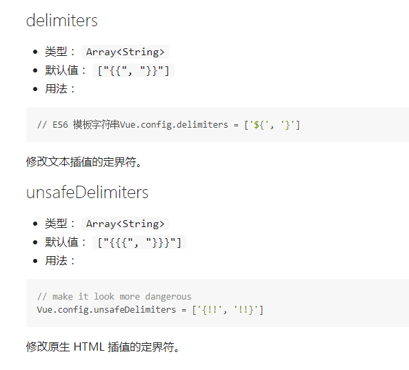

# 第一章 Vue.js特性

1. 确实轻量

    除了以MVP模式代表的Riot.js外，Vue.js已经算是前端库里面体积非常小的，但不依赖其他基础库。

2. 数据绑定

    对于一些富交互、状态机类似的前端UI界面，数据绑定非常方便、简单。

3. 指令

    类似于AngularJS，可以使用一些内置的简单指令(v-*)，也可以自定义指令，通过对应表达式值得变化就可以修改对应的DOM。

4. 插件化

    Vue.js核心库不包含Router、AJAX、表单验证等功能，但是可以非常方便地加载对应的插件。

# Vue.js与其他框架的区别

## 与AngularJS的区别

相同点：

- 都支持指令--内置指令和自定义指令。
- 都支持过滤器--内置过滤器和自定义过滤器。
- 都支持双向绑定。
- 都不支持低端浏览器(比如IE6/7/8)
    + Vue.js使用比如Array.isArray的ES5特性。
    + AngularJS 1.3开始不支持IE8。

不同点：

- AungularJS的学习成本比较高，而Vue.js本身提供的API都比较简单、直观。
- 在性能上，AngularJS依赖对数据做脏检查，所以Watcher越多越慢。Vue.js使用基于依赖追踪的观察并且使用异步队列更新，所有的数据都是独立触发的。

## 与React的区别

相同点：

- React采用特殊的JSX语法，Vue.js在组件开发中也推崇编写.vue特殊文件格式，对文件内容都有一些约定，两者都需要编译后使用。
- 中心思想相同：一切都是组件，组件实例之间可以嵌套。
- 都提供合理的钩子函数，可以让开发者定制化地处理需求。
- 都不内置类似AJAX、Router等功能到核心包，而是以其他方式(插件)加载。
- 在组件开发中都支持mixns的特性。

不同点：

- React依赖Virtual DOM，而Vue.js使用的是DOM模版。React采用的Virtual DOM会对渲染出来的结果做脏检查。
- Vue.js在模版中提供了指令、过滤器等，可以非常方便、快捷地操作DOM。

## 安装

- script

    直接通过script加载CDN文件，代码示例如下：

    `<script src="http://apps.bdimg.com/libs/vue/1.0.14/vue.js"></script>`

- npm

    如果项目基于npm管理依赖，则可以使用npm来安装Vue，执行如下命令：

    `$ npm i vue --save-dev`

- bower

    如果项目基于bower管理依赖，则可以使用bower来安装Vue，执行如下命令：

    `$ bower i vue --save-dev`

## 第一个HELLO World程序

代码示例如下：

```html
<div id="didi-navigator">
  <ul>
    <li v-for="tab in tabs">
      {{ tab.text }}
    </li>
  </ul>
</div>

new Vue({
  el: "#didi-navigator",
  data: {
    tabs: [
      { text: '巴士' },
      { text: '快车' },
      { text: '专车' },
      { text: '顺风车' },
      { text: '出租车' },
      { text: '代驾' }
    ]
  }
})
```

# 第二章 数据绑定

参考资料：

[Vue.js之数据绑定](http://www.cnblogs.com/fly_dragon/p/6218675.html "Vue.js之数据绑定")

## 插值

文本插值是最基本的形式，使用双大括号{{}}，代码示例如下：

`<span>Text: {{ text }}</span>`

只需要渲染一次数据，后续数据变化不再关心，可以通过"*"实现，代码示例如下：

`<span>Text: {{ *text }}</span>`

双大括号标签会把里面的值全部当做字符串来处理，如果是HTML片段，则可以使用三个大括号来绑定，代码示例如下：

```html
<div>Logo: {{{ logo }}}</div>
logo: '<span>DDFE</span>'
```

双大括号还可以放在HTML标签内，示例如下：

`<li data-id='{{ id }}'></li>`

## 表达式

Mustache标签也接受表达式形式的值，表达式可由JavaScript表达式和过滤器构成。过滤器可以没有，也可以有多个。

表达式是各种数值、变量、运算符的综合体。简单的表达式可以是常量或者变量名称。表达式的值是其运算结果，代码示例如下：

```html
<!-- JS表达式 -->
{{ cents/100 }}     //在原值的基础上除以100
{{ true ? 1 : 0 }}  //值为真，则渲染出1，否则渲染出0
{{ example.split(",") }}

<!-- 无效示例 -->
{{ var logo = 'DDFE' }}       //这是语句，不是表达式
{{ if(true) return 'DDFE' }}  //条件控制语句是不支持的，可以使用三元式
```

类似于Linux中的管道，Vue.js允许在表达式后面添加过滤符，代码示例如下：

`{{ example | toUpperCase }}`

## 指令



# 第三章 指令

## 内部指令

### v-if

v-if指令可以完全根据表达式的值在DOM中生成或移除一个元素。如果v-if表达式赋值为false，那么对应的元素就会从DOM中删除；否则，对应元素的一个克隆将被重新插入DOM中。代码示例如下：

```html
<div id="example">
	<span>nothing</span>
	<p v-if="greeting">Hello</p>
</div>
<script>
	var app = new Vue({
		el: "#example",
		data: {
			greeting: true
		}
	})
</script>
```

因为v-if是一个指令，需要将它添加到一个元素上。但是如果想切换多个元素，则可以把&lt;template&gt;元素当做包装元素，并在其上使用v-if，最终的渲染结果不会包含它。代码示例如下：

```html
<template v-if="ok">
	<h1>Title</h1>
	<p>Paragraph 1</p>
	<p>Paragraph 2</p>
</template>
```

### v-show

v-show指令是根据表达式的值来显示或者隐藏HTML元素。当v-show赋值为false时，元素将被隐藏。查看DOM时，会发现元素上多了一个内联样式`style="display: none;"`。代码示例如下：

```html
<input type="text" v-model="message" placeholder="edit me">
<div id="example">
  <p v-show="greeting">Hello!</p>
</div>
<script>
  var vm = new Vue({
    el: "#example",
    data: {
      greeting: false
    }
  })
</script>
```

**注：v-show不支持\<template\>语法，也不支持`v-else`**

在切换v-if模块时，Vue.js有一个局部编译/卸载的过程，因为v-if中的模版可能包括数据绑定或子组件。v-if是真实的条件渲染，因为它会确保条件块在切换时合适地销毁与重建条件块内的事件监听器和子组件。

v-if是惰性的---如果初始渲染时条件为假，则什么也不做，在条件第一次变为真时才开始局部编译(编译会被缓存起来)。

相比之下，v-show简单得多---元素始终被编译并保留，只是简单的基于CSS切换。

一般来说，v-if有更高的切换消耗，而v-show有更高的初始渲染消耗。因此，如果需要频繁地切换，则使用v-show较好；如果在运行条件不大可能改变，则使用v-if较好。

### v-else

就是JavaScript中else的意思，它必须跟着v-if或v-show，充当else功能。代码示例如下：

```html
<body>
  <div id="example">
    <p v-if="ok">我是对的</p>
    <p v-else="ok">我是错的</p>
  </div>
</body>
<script>
  var exampleVM2 = new Vue({
    el: '#example',
    data: {
      ok: false
    }
  })
</script>
```

将v-show用在组件上时，因为指令的优先级v-else会出现问题，所以不要这样做。代码示例如下：

```html
<custom-component v-show="condition"></custom-component>
<p v-else>这可能也是一个组件</p>
```

我们可以用另一个v-show替换v-else，代码示例如下：

```html
<custom-component v-show="condition"></custom-component>
<p v-show="!condition">这可能也是一个组件</p>
```

### v-model

v-model指令用来在input、select、text、checkbox、radio等表单控件元素上创建双向数据绑定。根据控件类型v-model自动选取正确的方法更新元素。但是v-model不过是语法糖，在用户输入时间中更新元素，以及特别处理一些极端的例子。代码示例如下：

```html
<div id="example">
  <form>
  	姓名：
  	<input type="text" v-model="data.name" placeholder="">
  	<br>
  	性别：
  	<input type="radio" id="man" value="One" v-model="data.sex">
  	<label for="man">男</label>
  	<input type="radio" id="male" value="Two" v-model="data.sex">
  	<label for="male">女</label>
  	<br>
  	兴趣：
  	<input type="checkbox" id="book" value="book" v-model="data.interest">
  	<label for="book">阅读</label>
  	<input type="checkbox" id="swim" value="swim" v-model="data.interest">
  	<label for="swim">游泳</label>
  	<input type="checkbox" id="game" value="game" v-model="data.interest">
  	<label for="game">游戏</label>
  	<input type="checkbox" id="song" value="song" v-model="data.interest">
  	<label for="song">唱歌</label>
  	<br>
  	身份：
  	<select v-model="data.identity">
  		<option value="teacher" selected="selected">教师</option>
  		<option value="doctor">医生</option>
  		<option value="lawyer">律师</option>
  	</select>
  </form>
  {{data.name}}
  <br>
  {{data.sex}}
  <br>
  {{data.interest}}
  <br>
  {{data.identity}}
  <br>
</div>
<script>
var vm = new Vue({
	el: "#example",
	data: {
		data: {
			name: '',
			sex: '',
			interest: [],
			identity: ''
		}
	}
})
</script>
```
